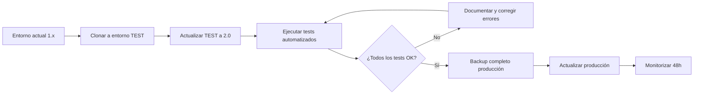

# 🏛️ Automatización para Bufetes de Abogados

> Sistema completo de automatización con n8n + IA para despachos jurídicos. Transforma tu bufete en un despacho digital eficiente.

[](https://choosealicense.com/licenses/mit/)
[](https://n8n.io)
[](https://openai.com)
[](https://python.org)

## 📋 Tabla de Contenidos
- [Compatibilidad n8n 2.0](#compatibilidad-n8n-20)

- [Características](#características)
- [Arquitectura del Sistema](#arquitectura-del-sistema)
- [Paquetes de Automatización](#paquetes-de-automatización)
- [Instalación](#instalación)
- [Roadmap de Implementación](#roadmap-de-implementación)
- [ROI Esperado](#roi-esperado)
- [Propuesta Comercial](#propuesta-comercial)
- [Documentación Técnica](#documentación-técnica)
- [Casos de Uso](#casos-de-uso)
- [Soporte](#soporte)

## ✨ Características

### 🤖 Inteligencia Artificial
- Chatbot jurídico 24/7 con clasificación automática de casos
- Generación de documentos legales con GPT-4
- Base de conocimiento RAG con jurisprudencia y legislación
- Extracción inteligente de datos de PDF y sentencias

### 📊 Gestión Automatizada
- Control de plazos con recordatorios inteligentes
- Gestión documental automática (clasificación y archivo)
- Facturación y seguimiento de cobros automatizado
- Dashboard de expedientes en tiempo real

### 🔗 Integraciones
- n8n (200+ workflows listos)
- Gmail, Outlook, Calendar
- WhatsApp, Telegram, Slack
- Google Drive, Notion, Airtable
- PostgreSQL, MySQL, MongoDB
- OpenAI, Gemini, LangChain

### 🔒 Seguridad y Compliance
- Cifrado de datos sensibles
- Control de acceso por roles
- Registro de auditoría completo
- RGPD compliant
- Backup automático

## 🏗️ Arquitectura del Sistema

```
┌─────────────────────────────────────────────────────────────┐
│                    CAPA DE ENTRADA                          │
│  Web │ WhatsApp │ Email │ Telegram │ Formularios           │
└────────────────────┬────────────────────────────────────────┘
                     │
┌────────────────────▼────────────────────────────────────────┐
│               CHATBOT JURÍDICO (IA)                         │
│  • Clasificación automática (laboral/familia/civil)         │
│  • Captura de datos del cliente                             │
│  • Cualificación de leads                                   │
└────────────────────┬────────────────────────────────────────┘
                     │
┌────────────────────▼────────────────────────────────────────┐
│                  n8n AUTOMATION HUB                         │
│  ┌──────────┐  ┌──────────┐  ┌──────────┐  ┌──────────┐  │
│  │ Gestión  │  │ Control  │  │ Generación│ │Facturación│ │
│  │Documental│  │ Plazos   │  │Documentos │ │ y Cobro  │  │
│  └──────────┘  └──────────┘  └──────────┘  └──────────┘  │
└────────────────────┬────────────────────────────────────────┘
                     │
┌────────────────────▼────────────────────────────────────────┐
│                  CAPA DE DATOS                              │
│  CRM │ PostgreSQL │ Google Drive │ Calendar │ RAG Vector DB│
└─────────────────────────────────────────────────────────────┘
```

## 📦 Paquetes de Automatización

### 🎯 Paquete 1: Captación y Cualificación de Leads

**Flujo completo:**
```
Web/WhatsApp → Chatbot → Clasifica caso → CRM → Email → Asigna abogado
```

**Componentes:**
- Chatbot jurídico con IA (clasificación laboral/familia/civil)
- Templates n8n Gmail (auto-respuesta)
- Templates Google Sheets + IA (scoring de leads)
- Notificaciones Telegram/Slack

**Valor:** Cliente atendido 24/7, sin intervención manual inicial.
**Ahorro:** 2-3h/día de recepción.

---

### 📄 Paquete 2: Gestión Documental Inteligente

**Flujo completo:**
```
Email PDF → Extraer texto → Clasificar IA → Drive (carpeta expediente) → Notificar
```

**Componentes:**
- Extracción automática de PDF
- Clasificación con GPT-4
- Organización en Google Drive por expediente
- Templates RAG (base de conocimiento)

**Valor:** Documentos clasificados y archivados automáticamente.
**Ahorro:** 5-7h/semana de gestión documental.

---

### ⏰ Paquete 3: Control de Plazos Automatizado

**Flujo completo:**
```
PDF sentencia → Extraer fechas IA → Calcular plazos → Calendar → Recordatorios (7d,3d,1d)
```

**Componentes:**
- Extracción de fechas con OpenAI
- Cálculo automático de plazos legales
- Integración Google Calendar
- Recordatorios multi-canal (Email/Telegram)

**Valor:** Riesgo CERO de pérdida de plazo.
**Ahorro:** Crítico - evita negligencias profesionales.

---

### 📝 Paquete 4: Generación de Documentos con IA

**Flujo completo:**
```
Datos expediente → Template IA → GPT-4 genera borrador → Abogado revisa → Cliente
```

**Componentes:**
- Prompts especializados por tipo de documento
- Integración con datos del CRM
- Generación con GPT-4o-mini
- Plantillas: demandas, contratos, convenios

**Valor:** Borradores en 2 min vs 30-45 min manual.
**Ahorro:** 10-15h/semana en despachos medianos.

---

### 🧠 Paquete 5: Base de Conocimiento RAG

**Flujo completo:**
```
Legislación + Jurisprudencia + Escritos → Vector DB → Chatbot RAG → Consulta → Respuesta citada
```

**Componentes:**
- Vectorización de documentos legales
- Chatbot RAG con Gemini/OpenAI
- Consultas en lenguaje natural
- Respuestas con citas de fuentes

**Valor:** Junior trabaja con conocimiento de senior.
**Ahorro:** 3-5h/semana de investigación jurídica.

---

### 💰 Paquete 6: Facturación y Cobro Automatizado

**Flujo completo:**
```
Hito expediente → Calcular honorarios → Generar factura → Email → Recordatorio impago
```

**Componentes:**
- Cálculo automático según tarifas
- Generación de facturas
- Envío y recordatorios por email
- Dashboard de morosidad

**Valor:** Facturación inmediata en hitos clave.
**Mejora:** Reducción morosidad 20-30%.


---

### 💼 Paquete 7: Gestión de Pruebas y Documentación Procesal

**Flujo completo:**
```
Recepción documento → Clasificación automática (IA) → Indexación en expediente → Extracción metadatos → Notificación equipo
```

**Componentes:**
- Clasificación automática de documentos (IA)
- OCR y extracción de datos clave
- Vinculación automática a expedientes
- Control de versiones y trazabilidad

**Valor:** Organización automática de pruebas documentales.
**Mejora:** Búsqueda y recuperación de documentos 80% más rápida.

---

### 📊 Paquete 8: Reporting y Business Intelligence

**Flujo completo:**
```
Datos del gestor → ETL automático → Dashboard Power BI/Metabase → Alertas KPIs → Email semanal ejecutivo
```

**Componentes:**
- Extracción de datos del software jurídico
- Dashboards de rentabilidad por área/cliente
- Análisis de tiempos y productividad
- Previsión de facturación mensual

**Valor:** Toma de decisiones basada en datos reales.
**Mejora:** Visibilidad completa de métricas de negocio en tiempo real.

---

### 🔐 Paquete 9: Compliance y Seguridad Documental

**Flujo completo:**
```
Nuevo documento → Verificación RGPD → Clasificación sensibilidad → Cifrado → Auditoría accesos → Log automático
```

**Componentes:**
- Control de accesos basado en roles
- Auditoría de consultas y modificaciones
- Backup automático cifrado
- Alertas de seguridad y accesos sospechosos

**Valor:** Cumplimiento RGPD y protección secreto profesional.
**Mejora:** 100% trazabilidad de acceso a información sensible.

---

### 🤝 Paquete 10: Onboarding de Clientes Automatizado

**Flujo completo:**
```
Contacto inicial → Formulario web → Verificación identidad → Firma contrato digital → Alta en gestor → Email bienvenida → Asignación abogado
```

**Componentes:**
- Formulario web inteligente con validaciones
- Firma electrónica integrada (Docusign/Autofirma)
- Verificación de identidad automatizada
- Creación automática de expediente y carpetas

**Valor:** Primera impresión profesional y paperless.
**Mejora:** Reducción tiempo onboarding de 3 días a 1 hora.

---

## 🎯 Casos de Uso por Especialidad

### Despacho Laboral
**Prioridad:** Plazos (conciliaciones, despidos), plantillas de demandas, cálculo indemnizaciones.
**Paquetes recomendados:** 2, 3, 4, 6

### Despacho Penal
**Prioridad:** Agenda procesal, gestión de pruebas, comunicación con clientes.
**Paquetes recomendados:** 2, 5, 7, 9

### Despacho Mercantil/Societario
**Prioridad:** Documentación compleja, facturación por proyecto, BI.
**Paquetes recomendados:** 3, 6, 8, 10

### Despacho Civil (Familia, Sucesiones)
**Prioridad:** Gestión documental, comunicación cliente, plantillas.
**Paquetes recomendados:** 1, 3, 5, 7

---

## 💰 Modelo de Implementación

### Fase 1: Diagnóstico (1-2 semanas)
- Auditoría de procesos actuales
- Identificación de cuellos de botella
- Propuesta de automatizaciones prioritarias
- ROI estimado por paquete

### Fase 2: MVP (3-4 semanas)
- Implementación de 2-3 paquetes críticos
- Configuración n8n y conexiones
- Formación equipo básica
- Soporte intensivo inicial

### Fase 3: Escalado (2-3 meses)
- Despliegue resto de paquetes
- Optimización flujos según feedback
- Formación avanzada
- Documentación completa

### Fase 4: Mantenimiento
- Soporte mensual
- Actualizaciones y mejoras
- Nuevas integraciones según necesidad
- Análisis continuo de KPIs

---

## 🛠️ Stack Tecnológico Recomendado

### Core de Automatización
- **n8n (self-hosted):** Orquestador principal de flujos
- **PostgreSQL:** Base de datos para n8n y logs
- **Redis:** Cache y colas de procesamiento

### Software Jurídico
- **LexTools / MN Program / Quolaw:** Gestión de expedientes
- **LexNET:** Notificaciones electrónicas judiciales
- **Registros.online / CORPME:** Consultas registrales

### Infraestructura
- **Cloud:** AWS (EC2 + RDS) o Hetzner (coste-efectivo para EU)
- **Backup:** S3 + cifrado
- **Monitorización:** Uptime Kuma + alertas Telegram

### Integraciones
- **Email:** IMAP/SMTP + Microsoft Graph API
- **Calendario:** CalDAV / Google Calendar API
- **Almacenamiento:** Nextcloud / OneDrive / Google Drive
- **IA:** OpenAI API / Anthropic Claude para clasificación y redacción
- **Firma:** Autofirma (gratuito) / Docusign (premium)

---

## 📈 ROI Estimado

### Despacho pequeño (2-5 abogados)
- **Inversión inicial:** 3.000-6.000€
- **Ahorro mensual:** 20-30h administrativas = 800-1.200€
- **ROI:** 3-6 meses

### Despacho mediano (6-15 abogados)
- **Inversión inicial:** 8.000-15.000€
- **Ahorro mensual:** 60-100h = 2.500-4.000€
- **ROI:** 3-5 meses

### Despacho grande (15+ abogados)
- **Inversión inicial:** 20.000-40.000€
- **Ahorro mensual:** 150-250h = 6.000-10.000€
- **ROI:** 3-4 meses

*Nota: Cifras orientativas. El ahorro real depende de procesos actuales, volumen de casos y nivel de adopción del equipo.*

---

## 🚀 Próximos Pasos

1. **Contacto inicial:** Reunión de 30 min para entender necesidades específicas
2. **Diagnóstico gratuito:** Auditoría de 1 semana de procesos actuales
3. **Propuesta personalizada:** Selección de paquetes + roadmap + presupuesto
4. **Prueba de concepto:** Implementar 1 automatización crítica (sin coste si no aporta valor)


---

## ⚠️ Compatibilidad n8n 2.0

> **🚨 IMPORTANTE:** n8n lanzó la versión 2.0 el 15 de diciembre de 2025 con cambios significativos. Esta documentación ha sido actualizada para reflejar la compatibilidad con n8n 2.0.

### 🔄 ¿Qué ha cambiado en n8n 2.0?

**Nuevas características:**
- ✅ Auto-guardado automático de workflows
- ✅ UI completamente rediseñada y más intuitiva
- ✅ Mejoras significativas de seguridad
- ✅ 70+ nodos de IA nativos (LLMs, embeddings, OCR, speech)
- ✅ Mejor rendimiento y escalabilidad
- ✅ Subworkflows optimizados
- ✅ Sistema de carpetas mejorado

**Breaking changes críticos que afectan a este proyecto:**

1. **🔑 Code Nodes y API Keys**
   - Cambios en cómo se gestionan las credenciales en nodos de código
   - **Impacto:** Paquetes 3, 7 (procesamiento de documentos con IA)
   - **Acción:** Revisar nodos de código que accedan a APIs externas

2. **🔗 Autenticación OAuth**
   - Métodos OAuth pueden requerir reconfiguración
   - **Impacto:** Paquetes 1, 2, 4, 5 (Google Calendar, Microsoft Graph, Gmail)
   - **Acción:** Validar y reconectar integraciones OAuth

3. **🔀 Sub-workflows y Wait Nodes**
   - Modificaciones en comportamiento de workflows anidados
   - **Impacto:** Paquetes 8, 9 (BI y Compliance con lógica compleja)
   - **Acción:** Testear flujos con múltiples sub-workflows

4. **📦 HTTP Request Node**
   - Nuevos protocolos de seguridad y manejo de certificados
   - **Impacto:** Todos los paquetes que consuman APIs REST
   - **Acción:** Verificar conexiones a APIs de software jurídico (LexNET, registros)

5. **📊 Base de datos MySQL/MariaDB**
   - Cambios en conexiones a bases de datos
   - **Impacto:** Paquete 8 (BI y reporting con base de datos)
   - **Acción:** Actualizar strings de conexión

### 🧪 Guía de Migración

📚 **Documentación oficial:** [n8n 2.0 Breaking Changes Guide](https://docs.n8n.io/2-0-breaking-changes/)

#### Estrategia de Migración Recomendada

**NUNCA actualices directamente en producción.** Sigue esta secuencia:



#### ✅ Checklist Pre-Migración

Antes de actualizar **cualquier** instancia con workflows de clientes:

- [ ] **Backup completo** de base de datos n8n (PostgreSQL)
- [ ] **Exportar todos los workflows** como JSON
- [ ] **Documentar credenciales OAuth** activas
- [ ] **Listar nodos de código** que usan variables de entorno
- [ ] **Identificar sub-workflows** complejos
- [ ] **Crear entorno de testing** aislado
- [ ] **Revisar changelog completo:** [n8n releases](https://github.com/n8n-io/n8n/releases)

#### 🛠️ Testing por Paquete

Dependiendo de qué paquetes implementes, estos son los tests críticos:

| Paquete | Test prioritario | Riesgo |
|---------|------------------|--------|
| **1. CRM y Leads** | Verificar OAuth Google Sheets / HubSpot | 🟡 Medio |
| **2. Plazos** | Probar creación eventos en Google Calendar / Outlook | 🟡 Medio |
| **3. Documentos** | Validar generación PDFs con IA (OpenAI API) | 🔴 Alto |
| **4. Email** | Confirmar envío SMTP e IMAP | 🟢 Bajo |
| **5. Comunicación** | Testear WhatsApp Business API / Twilio | 🟡 Medio |
| **6. Facturación** | Validar cálculo honorarios y generación facturas | 🔴 Alto |
| **7. Pruebas** | Verificar OCR y clasificación IA de documentos | 🔴 Alto |
| **8. BI** | Comprobar conexión MySQL y queries ETL | 🔴 Alto |
| **9. Compliance** | Auditar logs y trazabilidad de accesos | 🔴 Alto |
| **10. Onboarding** | Probar firma electrónica (Docusign/Autofirma) | 🟡 Medio |

🔴 **Alto:** Requiere testing exhaustivo y posibles ajustes  
🟡 **Medio:** Verificar funcionamiento básico  
🟢 **Bajo:** Cambios mínimos esperados

### 📝 Estado de Compatibilidad

**Última actualización:** 11 de diciembre de 2025

| Paquete | Estado n8n 2.0 | Notas |
|---------|----------------|-------|
| Paquete 1 | 🟡 Requiere validación | Revisar OAuth Google/HubSpot |
| Paquete 2 | 🟡 Requiere validación | Verificar CalDAV |
| Paquete 3 | 🟠 En testing | Ajustes en nodos IA |
| Paquete 4 | ✅ Compatible | Sin cambios necesarios |
| Paquete 5 | 🟡 Requiere validación | Confirmar webhooks |
| Paquete 6 | 🟠 En testing | Revisar cálculos complejos |
| Paquete 7 | 🟠 En testing | Actualizar prompts IA |
| Paquete 8 | 🔴 Requiere ajustes | Conexiones DB |
| Paquete 9 | 🟠 En testing | Validar logs |
| Paquete 10 | 🟡 Requiere validación | Probar Docusign |

**Leyenda:**
- ✅ Compatible: Funciona sin cambios
- 🟡 Requiere validación: Testear antes de usar
- 🟠 En testing: Pruebas en curso
- 🔴 Requiere ajustes: Modificaciones necesarias documentadas

### 🚀 Instalación Entorno de Testing

#### Opción 1: Docker (Recomendado para testing rápido)

```bash
# Crear directorio de testing
mkdir n8n-2.0-test && cd n8n-2.0-test

# Docker Compose con n8n 2.0
cat > docker-compose.yml << 'EOF'
version: '3.8'

services:
  n8n:
    image: n8nio/n8n:2.0
    ports:
      - "5678:5678"
    environment:
      - N8N_BASIC_AUTH_ACTIVE=true
      - N8N_BASIC_AUTH_USER=admin
      - N8N_BASIC_AUTH_PASSWORD=test123
    volumes:
      - ./n8n-data:/home/node/.n8n
      - ./workflows:/workflows
EOF

# Levantar entorno
docker-compose up -d

# Acceder: http://localhost:5678
```

#### Opción 2: Instalación local con npm

```bash
# Instalar n8n 2.0
npm install -g n8n@2.0

# Iniciar en modo test
export N8N_PORT=5679
export N8N_PROTOCOL=http
n8n start
```

#### Importar workflows de este repositorio

```bash
# Clonar el repo con los workflows de ejemplo
git clone https://github.com/[tu-usuario]/automatizacion-bufetes-abogados.git
cd automatizacion-bufetes-abogados/workflows

# Los workflows JSON estarán disponibles para importar en n8n UI
```

### 📊 Reportar Problemas de Compatibilidad

Si encuentras problemas con n8n 2.0:

1. **Crea un issue** en este repositorio: [Nuevo Issue](https://github.com/[tu-usuario]/automatizacion-bufetes-abogados/issues/new)
2. **Incluye:**
   - Versión exacta de n8n (`n8n --version`)
   - Paquete afectado
   - Descripción del error
   - Screenshots si es posible
   - Logs relevantes

### 🔗 Recursos Adicionales

- 📚 [Documentación oficial n8n 2.0](https://docs.n8n.io/)
- 🔧 [Guía de migración completa](https://docs.n8n.io/2-0-breaking-changes/)
- 💬 [Comunidad n8n](https://community.n8n.io/t/announcing-n8n-version-2-0-coming-soon/226475)
- 🚀 [Changelog completo](https://github.com/n8n-io/n8n/blob/master/CHANGELOG.md)
- 🎬 [Video: Preparación para n8n 2.0](https://www.youtube.com/watch?v=yAZy5EooyCo)

---
---

## 📞 Contacto

**Consultor:** [Tu nombre]
**Email:** [tu-email]
**LinkedIn:** [tu-perfil]
**Repositorio:** github.com/[tu-usuario]/automatizacion-bufetes-abogados

---

## 📚 Recursos Adicionales

- [Guía completa n8n para abogados](enlace-a-documentacion)
- [Plantillas de flujos descargables](enlace-a-repo)
- [Casos de éxito y testimonios](enlace)
- [Webinar: Automatización legal en 2025](enlace)

---

**Licencia:** MIT  
**Última actualización:** Diciembre 2025
